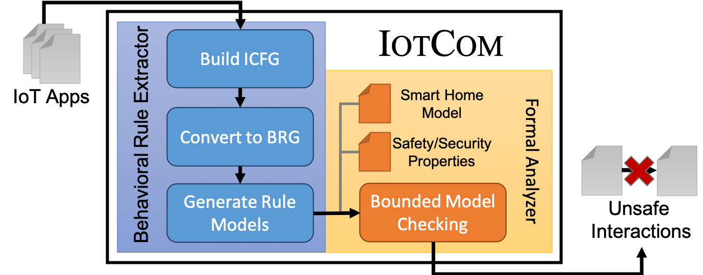

# Overview

In this repository you will find the protype code of IoTCOM, a model-checking tool to verify the safety of IoT Apps.

This work is published at *ACM SIGSOFT International Symposium on Software Testing and Analysis (ISSTA'20)* and received **ACM SIGSOFT Distinguished Paper Award**. 

Here you can find the [draft paper](https://drive.google.com/file/d/1DtnaSgLVQ81HhktsWCMpHMCVZ0nMQAnK/view?usp=sharing)


# IoTCOM Architecture 

IoTCOM comprises two components:

1- Behavioral Rule Extractor (BRE): generates the behavioral models of the IoT apps (groovy and IFTTT).

2- Formal Analyzer (FA): relies on Alloy to perform formal verification to check the safety IoT apps.




# IoTCOM_Behavioral Rule Extractor

This component has been tested on MacOS and Linux. To use this component: 

1. Create an Eclipse project and clone this repository (you can find the instructions [here](https://github.com/collab-uniba/socialcde4eclipse/wiki/How-to-import-a-GitHub-project-into-Eclipse)).
  - Add all libraries (.jar files) in the `BehavioralRuleExtractor/lib` folder.

2. Run the "ToAlloy.java" as "Java Application". Put the Goovy apps inside the directory `input/sampleGroovyApps`. More Groovy apps can be obtained from [SmartThings Public GitHub Repo](https://github.com/SmartThingsCommunity/SmartThingsPublic).  The resulting Alloy models (.als files) will be generated and stored in `/IoTCOM/BehavioralRuleExtractor/output/sampleApps`. The models that are generatd using our tool are in the directory `Dataset_RealWorldApps`


# IoTCOM_Formal Analyzer

The Formal Analyzer component can be built and run using Gradle. Java 8 or above is required. This component has been tested on MacOS and Linux.

To build an all-in-one jar file using Gradle:

1. Clone the repository.
1. Change to the `FormalAnalyzer` folder.
1. Run `./gradlew customFatJar`.
1. Run `java -jar build/libs/iotcom-all-1.0.0.jar [arguments]`

The arguments are described in greater detail in the [`FormalAnalyzer`](FormalAnalyzer/src/main/java/edu/unl/cse/iotcom/FormalAnalyzer.java#L33-L51) Java file. The user can specify a variety of options, such as the directory for app files, the output directory, the size of the generated bundles, etc.

> :warning: **Running with the defaults will take a _very_ long time.** Specify a value for the `--appsdir` argument on the command line.

As an example, to run the same analysis as our test files, invoke the jar like this:
```
java -jar build/libs/iotcom-all-1.0.0.jar \
  --appsdir models/test/ \
  --seed 1587400397957 \
  --bundlesizes 3 \
  --prplist t1
```

To run apps generated by the Behavioral Rule Extractor, specify the output directory of that tool instead (e.g., `--appsdir ../BehavioralRuleExtractor/output/sampleApps`).

The app was built using IntelliJ IDEA, but could also be imported into Eclipse using the Gradle import wizard.

# Citation
```
@INPROCEEDINGS{iotcom,
    AUTHOR="M. Alhanahnah and C. Stevens and H. Bagheri",
    TITLE="Scalable Analysis of Interaction Threats in IoT Systems",
    BOOKTITLE="ISSTA 2020",
    YEAR="2020",
}
```
